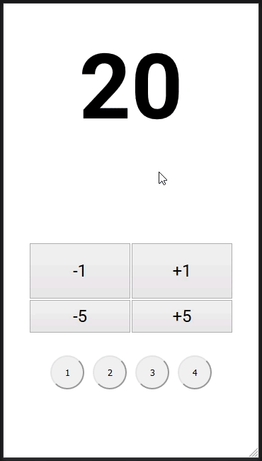
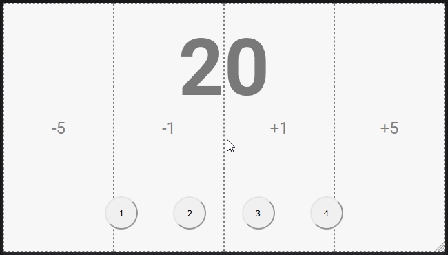
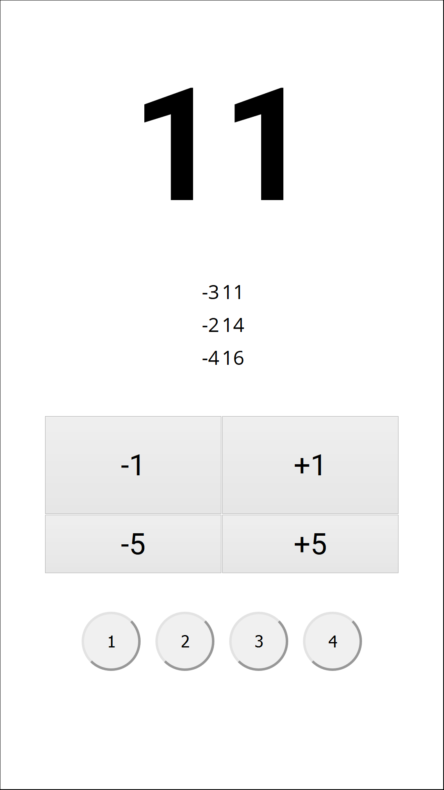
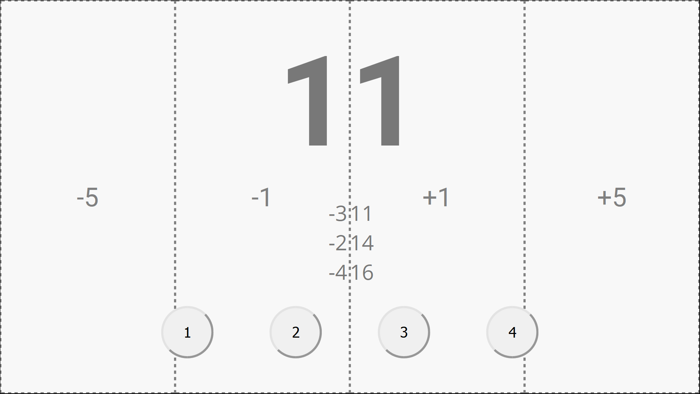
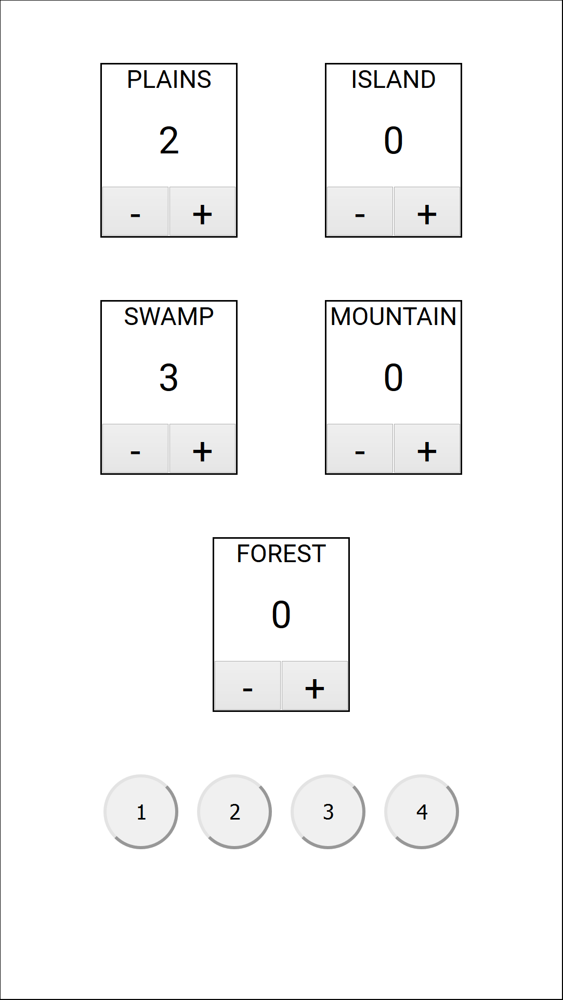
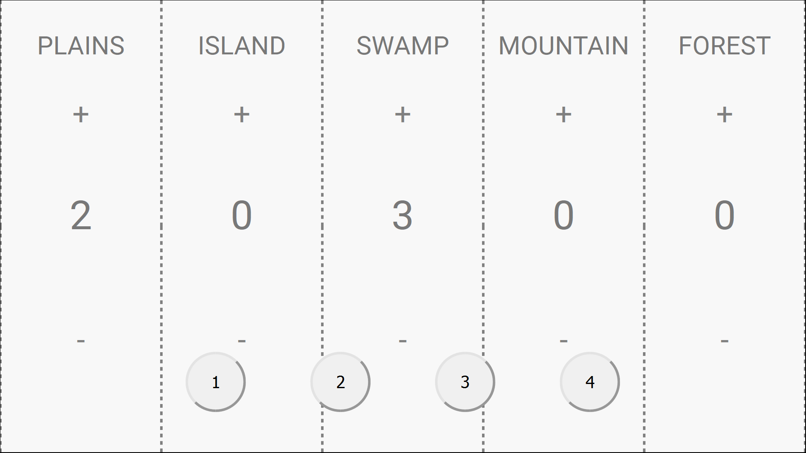
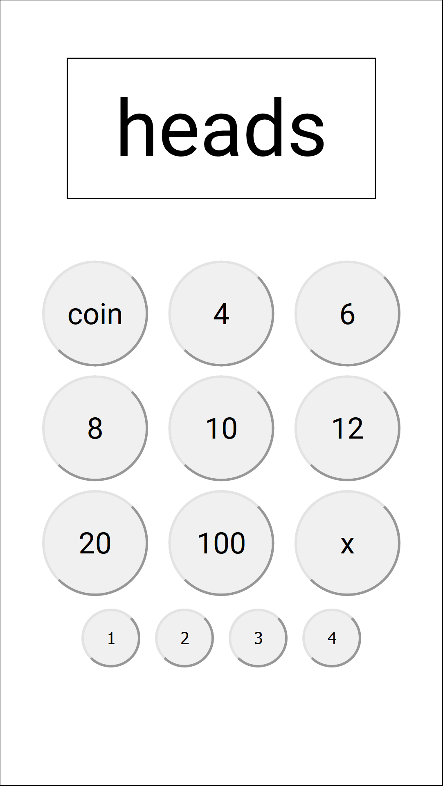
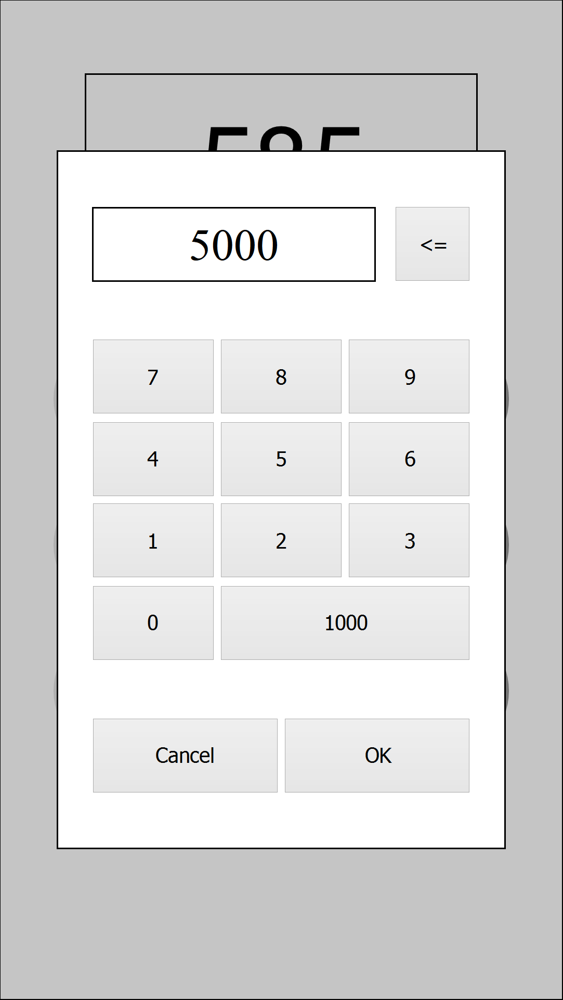
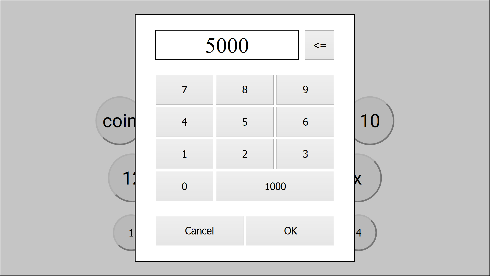

# Magic: The Gathering Companion App

A Magic: The Gathering companion app that lets players track their counters and sync their devices with other players they are in a match with.

---

## Table of Contents

* [Description](#description)
  * [Demo](#demo)
  * [Status](#status)
* [Features](#features)
* [Getting Started](#getting-started)
  * [Prerequisites](#prerequisites)
  * [Installation](#installation)
  * [Testing](#testing)
  * [Deployment](#deployment)
* [Technologies](#technologies)
* [Author](#author)
* [Acknowledgement](#acknowledgement)
* [License](#license)
* [Database Properties](#database-properties)
* [API Routes](#api-routes)

---

## Description

This web app will let players join up with other players in an in-app room where they would be able to monitor each other's life points, counters, dice rolls, and other MTG essentials. The players would be able to join rooms using their own accounts on their own devices thus eliminating the need for players to share and pass around a single device to keep track of their match data. Having the ability monitor all the match data on separate devices also allows player to be able to play with each other remotely, even if they are using real cards and not playing on MTG Arena or some other online platform.

Portrait view                                                                               | Landscape view
--------------------------------------------------------------------------------------------|---------------
                                                     | 
<!-- **Life/poison counter**            | **Life/poison counter**  -->
<!-- **Land counter**                     | **Land counter**  -->
<!-- **Dice roller**                              | **Dice roller**  -->
<!-- **Dice roller - custom number modal**  | **Dice roller - custom number modal**  -->

### Demo

Check out the demo [here](http://mtg.justingajitos.com)!

### Status

The project is still in early development.

## Features

* Life counter
* Poison counter
* Mana counter
* Dice roller

**To Do:**

* Log in system
  * Admin panel
  * Password reset
* Theme changer
* Room system where up to eight players can join to share each others counters that updates real time.
  * Implementations for different formats
    * Two-Headed Giant
    * Free-For-All
    * Assassin
    * Emperor
  * Join link sharing functionality
  * Timestamp and edit history
* Card lookup
* Rule lookup

## Getting Started

These instructions will get you a copy of the project up and running on your local machine for development and [testing](#testing) purposes. See [deployment](#deployment) for notes on how to deploy the project on a live system.

### Prerequisites

You need to have [Node.js](https://nodejs.org/en/) and [git](https://git-scm.com/downloads) installed on your local machine.

### Installation

In your terminal:

```shell
# Clone the repo
$ git clone https://github.com/thirte3n/mtg.git

# Go inside the project directory
$ cd mtg

# Install dependencies (server and client)
$ npm install
$ cd client
$ npm install
$ cd ..

# Rename the .env-sample to to .env and replace the pre-written values to match your needs
$ mv .env-sample .env

# Run the React build script
$ cd client
$ npm i
$ cd ..

# Run the app
$ npm start

# OR

# Run the app in development (client on PORT 3000, server on PORT 5000)
$ npm run dev

# OR

# Run just the client in development (on PORT 3000)
$ npm run client

# OR

# Run just the server in development using nodemon (on PORT 5000)
$ npm run server
```

### Testing

To run the tests, open the root project directory in your terminal. Run `npm install` to install all necessary dependencies then run `npm test` to run automated tests.

To run manual tests for the api, the `/http/*.http` files can be run using the [REST Client](https://marketplace.visualstudio.com/items?itemName=humao.rest-client) extension for Visual Studio Code.

### Deployment

Before deploying to a server or host of your choice, run the build script for the client.

```shell
# Go inside client directory
$ cd client

# Run the React build script
$ npm run build
```

## Technologies

This project is built with:

* Node
* MongoDB

* Client
  * React (create-react-app)
  * Redux
  * React-Redux
  <!-- * redux-thunk -->
  <!-- * socket.io-client -->
  <!-- * Web Share API -->

* Server
  * Express
  <!-- * bcryptjs -->
  <!-- * *colors -->
  <!-- * *cors -->
  * dotenv
  <!-- * jsonwebtoken -->
  <!-- * Mongoose -->
  <!-- * Morgan -->
  <!-- * socket.io -->
  * Dev Dependencies
    * concurrently
    * nodemon

* Testing
  * Chai
  * Mocha
  * Supertest

<!-- * External API
  * [Magic: The Gathering SDK](https://github.com/MagicTheGathering/mtg-sdk-javascript) -->

## Author

- **[Justin Gajitos](https://www.justingajitos.com)** ([thirte3n](https://github.com/thirte3n))

## Acknowledgement

This app was inspired by [MTG Familiar](https://github.com/AEFeinstein/mtg-familiar). This app's dice roll component's general design was based on their dice feature.

## License

This project is licensed under the GNU GENERAL PUBLIC LICENSE Version 3 - see the [LICENSE](LICENSE) file for details

<!--
## Contributing

TODO:
-->

## Database Properties

* **User**
  * username - String, required, minlength: 4, maxlength: 20, trim, lowercase
  * password - String, required, minlength: 8, maxlength: 30
  * isAdmin - Boolean, default: false
  * firstName - String, required, minlength: 1, maxlength: 20
  * lastName - String, required, minlength: 1, maxlength: 20
  * dateRegistered - Date, default: Date.now
  * counter
    * life - Number, default: 20
    * poison - Number, default: 0
    * land
      * plains - Number, default: 0
      * island - Number, default: 0
      * swamp - Number, default: 0
      * mountain - Number, default: 0
      * forest - Number, default: 0
  * theme - String, default: 'plains'
  * userRooms - Array
    * roomId - Number, required

<!--
* **Rooms**
  * room
    * roomId - Number
    * roomOwner - String
    * messages
      * message
        * username - String
        * content - String, required, minlength: 1, maxlength: 140, trim
        * date - Date, default: Date.now
    * users
      * username - String
      * counter
        * life - Number, default: 20
        * poison - Number, default: 0
        * land
          * plains - Number, default: 0
          * island - Number, default: 0
          * swamp - Number, default: 0
          * mountain - Number, default: 0
          * forest - Number, default: 0
        * dateEdited - Date, default: Date.now
-->

## API Routes

* /api/v1/users
  * Method: GET
    * Description: Get list of all users
    * Access: Public
    * URL Params: none
    * Data Params: none
    * Success Response:
      ```json
      Status: 200 OK
      Body:
      {
        "success": true,
        "status": 200,
        "count" : 2,
        "data": [
          {
            "counter": {
              "land": {
                "plains": 0,
                "island": 0,
                "swamp": 0,
                "mountain": 0,
                "forest": 0
              },
              "life": 20,
              "poison": 0
            },
            "theme": "plains",
            "_id": "5fae6561da4490340888017e",
            "username": "hifumin",
            "firstName": "Hifumi",
            "lastName": "Takimoto",
            "dateRegistered": "2020-11-13T10:52:17.061Z",
            "userRooms": [],
            "__v": 0
          },
          {
            "counter": {
              "land": {
                "plains": 0,
                "island": 0,
                "swamp": 0,
                "mountain": 0,
                "forest": 0
              },
              "life": 20,
              "poison": 0
            },
            "theme": "plains",
            "_id": "5fae667bda4490340888017f",
            "username": "aocchi",
            "firstName": "Aoba",
            "lastName": "Suzukaze",
            "dateRegistered": "2020-11-13T10:56:59.487Z",
            "userRooms": [],
            "__v": 0
          }
        ]
      }
      ```
    * Error Response:
      ```json
      Status: 500 Server Error
      Body:
      {
        "success": false,
        "status": 500,
        "error": "Server Error"
      }
      ```
    * Sample Call: `GET http://mtg.justingajitos.com/api/v1/users HTTP/1.1`
    * Notes: none

  * Method: POST
    * Description: Create a new user
    * Access: Public
    * URL Params: none
    * Data Params: required
      ```json
      Body:
      {
        "user": {
          "username": String, Minimium Length:  4, Maximum Length:  20, Required,
          "firstName": String, Minimium Length:  1, Maximum Length:  20, Required,
          "lastName": String, Minimium Length:  1, Maximum Length:  20, Required,
          "password": String, Minimum Length:  8, Maximum Length:  30, Required
        }
      }
      ```
    * Success Response:
      ```json
      Status: 201 Created
      Body:
      {
        "success": true,
        "status": 201,
        "data": {
          "user" : {
            "counter": {
              "land": {
                "plains": 0,
                "island": 0,
                "swamp": 0,
                "mountain": 0,
                "forest": 0
              },
              "life": 20,
              "poison": 0
            },
            "isAdmin": false,
            "theme": "plains",
            "_id": "5fae66ffda44903408880180",
            "username": "kochan",
            "firstName": "Kou",
            "lastName": "Yagami",
            "password": "$2a$10$ARGWhGizXo6WmjX6NZFkDeCnAsC48vBUgQyYMhi8YPJqAJ9gH4tBW",
            "dateRegistered": "2020-11-13T10:59:11.278Z",
            "userRooms": [],
            "__v": 0
          }
        }
      ```
    * Error Response:
      * Error: A required field is missing or data type is incorrect, input length too short or short
        ```json
        Status: 400 Bad Request
        Body:
        {
          "success": false,
          "status": 400,
          "error": "Bad Request"
        }
        ```
      * Error: Username is already taken
        ```json
        Status: 400 Bad Request
        Body:
        {
          "success": false,
          "status": 400,
          "error": "Username is already taken"
        }
        ```
    * Sample Call
      ```json
      POST mtg.justingajitos.com/api/v1/users
      Content-Type: application/json
      Body:
      {
        "user": {
          "username": "aocchi",
          "firstName": "Aoba",
          "lastName": "Suzukaze",
          "password": "nenecchi"
        }
      }
      ```
    * Notes: none

* /api/v1/users/:username
  * Method: GET
    * Description: Get details of a single user
    * Access: Public
    * URL Params: required `username=[String]`
    * Data Params: none
    * Success Response:
      ```json
      Status: 200 OK
      Body:
      {
        "success": true,
        "status": 200,
        "data": {
          "user": {
            "counter": {
              "land": {
                "plains": 0,
                "island": 0,
                "swamp": 0,
                "mountain": 0,
                "forest": 0
              },
              "life": 20,
              "poison": 0
            },
            "theme": "plains",
            "_id": "5fae6ec501672e343c2bf423",
            "username": "hifumin",
            "firstName": "Hifumi",
            "lastName": "Takimoto",
            "dateRegistered": "2020-11-13T11:32:21.006Z",
            "userRooms": [],
            "__v": 0
          }
        }
      }
      ```
    * Error Response:
      * Error: User does not exist
        ```json
        Status: 404 Not Found
        Body:
        {
          "success": false,
          "status": 404,
          "error": "User does not exist"
        }
        ```
    * Sample Call: `GET http://mtg.justingajitos.com/api/v1/users/hifumin`
    * Notes: none

  * Method: PUT
    * Description: Update user information
    * Access: Private - owner or admin
    * URL Params: required `userId=[String]`
    * Data Params: required at least 1 change
      ```json
      x-auth-token: JWT token
      Body:
      {
        "user": {
          (see Database Properties)
        }
      }
      ```
      (see [Database Properties](#database-properties))
    * Success Response:
      ```json
      Status: 200 OK
      Body:
      {
        "success": true,
        "status": 200,
        "data": {}
      }
      ```
    * Error Response:
      * Error: Any payload has an invalid value, username is already taken, invalid payload property
        ```json
        Status: 400 Bad Request
        Body:
        {
          "success": false,
          "status": 400,
          "error": "Bad Request"
        }
        ```
      * Error: User does not exist
        ```json
        Status: 404 Not Found
        Body:
        {
          "success": false,
          "status": 404,
          "error": "Not Found"
        }
        ```
      * Error: No token sent
        ```json
        Status: 401 Not Authorized
        Body:
        {
          "success": false,
          "status": 401,
          "error": "Not Authorized"
        }
        ```
    * Sample Call:
      ```json
      PUT mtg.justingajitos.com/api/v1/users/hifumin
      Content-Type: application/json
      x-auth-token: token

      Body:
      {
        "user": {
          "username": "chosenone",
          "firstName": "Harry",
          "lastName": "Potter",
          "password": "ginnyweasley"
        }
      }
      ```
    * Notes: when updating the values inside "counter", you must send the complete "counter" object with all its properties and values, or else, only the sent values will be updated and the rest of the "counter" values will revert to their default value as defined in the schema.

  * Method: DELETE
    * Description: Delete a user
    * Access: Private - owner or admin
    * URL Params: required `userId=[String]`
    * Data Params: required `x-auth-token: token`
    * Success Response:
      ```json
      Status: 200 OK
      Body:
      {
        "success": true,
        "status": 200,
      }
      ```
    * Error Response:
      * Error: User does not exist
        ```json
        Status: 404 Not Found
        Body:
        {
          "success": false,
          "status": 404,
          "error": "Not Found"
        }
        ```
      * Error: No token sent
        ```json
        Status: 401 Not Authorized
        Body:
        {
          "success": false,
          "status": 401,
          "error": "Not Authorized"
        }
        ```
    * Sample Call:
      ```
      DELETE mtg.justingajitos.com/api/v1/users/hifumin
      x-auth-token: token
      ```
    * Notes: none
<!--
* /api/v1/auth
  * Method: POST
    * Description: Authenticate/login user and returns JWT token
    * Access: Public
    * URL Params: none
    * Data Params: required
      ```json
      {
        "user": {
          "username": String, Required,
          "password": String, Minimum Length = 8, Required
        }
      }
      ```
    * Success Response:
      ```json
      Status: 200 OK
      Body:
      {
        "success": true,
        "status": 200,
        "token": token,
        "data": {
          "user": {
            "username": "chosenone",
            "firstName": "Harry",
            "lastName": "Potter"
          }
        }
      }
      ```
    * Error Response:
      * Error: Incomplete data submitted, invalid credentials, user does not exist
        ```json
        Status: 400 Bad Request
        Body:
        {
          "success": false,
          "status": 400,
          "error": "Bad Request"
        }
        ```
    * Sample Call:
      ```json
      POST mtg.justingajitos.com/api/v1/auth
      Content-Type: application/json

      Body:
      {
        "user": {
          "uosername": "chosenone",
          "password": "ginnyweasley"
        }
      }
      ```
    * Notes:

* /api/v1/auth/user
  * Method: GET
    * Description: Get all user data except for password
    * Access: Private
    * URL Params: none
    * Data Params: required `x-auth-token: token`
    * Success Response:
      ```json
      Status: 200 OK
      Body:
      {
        "success": true,
        "status": 200,
        "data": {
          "User": {
            "username": "chosenone",
            "isAdmin": false,
            "firstName": "Harry",
            "lastName": "Potter",
            "dateRegistered": "2020-04-07T04:16:58.713Z",
            "counter": {
              "life": 20,
              "poison": 0,
              "land": {
                "plains": 0,
                "island": 0,
                "swamp": 0,
                "mountain": 0,
                "forest": 0
              }
            },
            "theme": "plains",
            "userRooms": []
          },
        }
      }
      ```
    * Error Response:
      * Error: No token sent
        ```json
        Status: 401 Not Authorized
        Body:
        {
          "success": false,
          "status": 401,
          "error": "Not Authorized"
        }
        ```
      * Error: Token not valid
        ```json
        Status: 400 Bad Request
        Body:
        {
          "success": false,
          "status": 400,
          "error": "Bad Request"
        }
        ```
    * Sample Call:
      ```
      GET mtg.justingajitos.com/api/v1/auth/user
      x-auth-token: token
      ```
    * Notes:
-->
